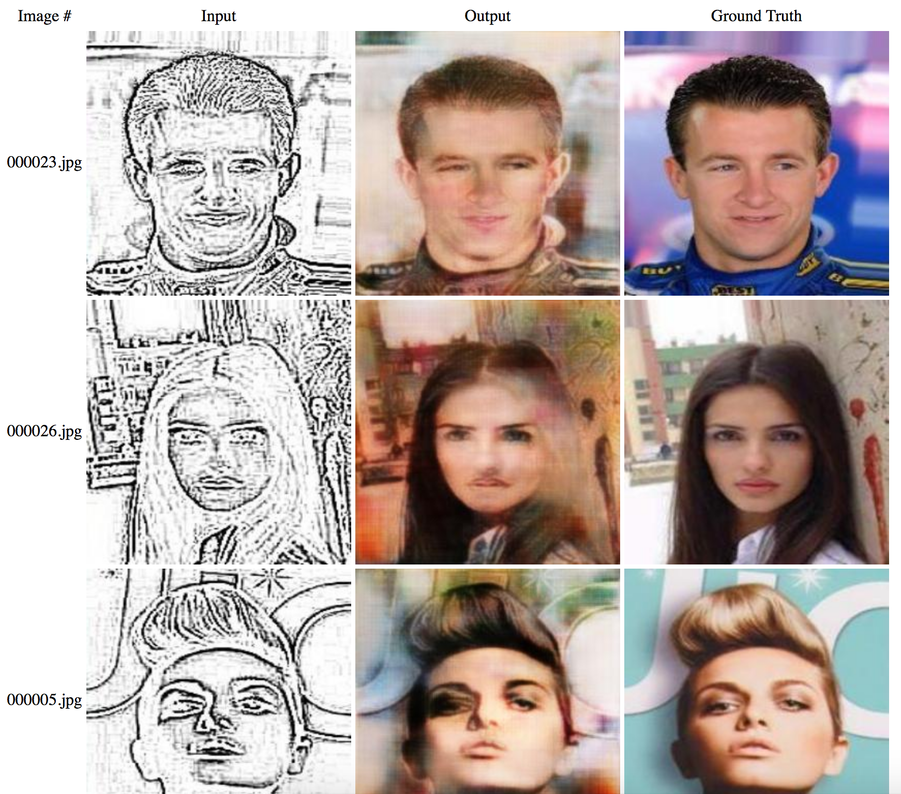

## Synopsis

The goal of this project is to use Machine Learning to transform police sketches to realistic images.

## Motivation

The overall motivation is to help the police better identify and catch the bad guys faster.

## Requirements
* [imagemagick](https://imagemagick.org/script/index.php) 

## Creating Datasets
1. Create a folder in `sketch2pix/dataset`
	*	ie. `faces-edge1`
2. Within that folder create 3 folders `edge`, `face`, `face2edge`
3. Within each of those 3 folders create 2 folders `test`, `train`
4. Put your output images in the `face` folder and split them however you want into the `test` and `train` folders. It's recommended you train on 70% of your images and test the other 30%
5. Use the `convert.sh` script to generate the edge versions (aka inputs) of your `face` images
	* in the `sketch2pix/dataset` run 

	```bash
	./convert.sh --path faces-edge1 --edge 1
	```
	
	* [--edge](https://www.imagemagick.org/script/command-line-options.php?#edge) is the fineness of the edges you want to generate [1 = low, 10 = high] 
	* **This command will output to the `edge` folder**
	
6. Use the `combine.sh` script to generate the combination images needed for `pix2pix` to train and test
	* in the `sketch2pix/dataset` run 
	
	```bash
	./combine.sh --path faces-edge1
	```
	
	* **This command will output to the `face2edge` folder**


## Training a Model
In `sketch2pix`

Run 

```bash
./train.sh --data-root ../dataset/faces-edge1/face2edge --name edge2face_edge1_generation --direction BtoA"
```
Required parameters:

`--data-root`: the `face2edge` folder of your dataset

`--name` : name of experiment

`--direction` : `BtoA` or `AtoB`

As the model trains checkpoints will be stored in:

```
sketch2pix/pix2pix/checkpoints/{--name}

```
where `--name` is the value passed into the scripts from above.


[More info here](https://github.com/phillipi/pix2pix#train)


## Testing a Model
In `sketch2pix`

Run 

```bash
./test.sh --data-root ../dataset/faces-edge1/face2edge --name edge2face_edge1_generation --direction BtoA"
```

Required parameters:

`--data-root`: the `face2edge` folder of your dataset

`--name` : should be the same as what was used in the train script

`--direction` : `BtoA` or `AtoB`

[More info here](https://github.com/phillipi/pix2pix#test)


## Validating your models
After testing your results are stored in 

```
sketch2pix/pix2pix/results/{--name}/latest_net_G_test/index.html
```
where `--name` is the value passed into the scripts from above.

Open that html file in a browser to examine the results of your test.



## TODO
On how to improve it
 
* In the input photos, we can run a face segmentation system that will put the background in white color and only train with faces. This way, the generated photos will also have a white background and the sketches will not have the background either.
* Finding a more realistic sketching that matches pencil sketches.


## Acknowledgements

* [pix2pix](https://github.com/phillipi/pix2pix)

## Contributors

* **[User1m](https://github.com/user1m)** - *Script development and model training / testing*
* **[koul](https://github.com/koul)** - *Seed idea*
* **[wtam](https://github.com/wtam)**, **[tikyau](https://github.com/tikyau)**, **[getCloudy](https://github.com/getCloudy)** - *Help with data generation*

## License

MIT